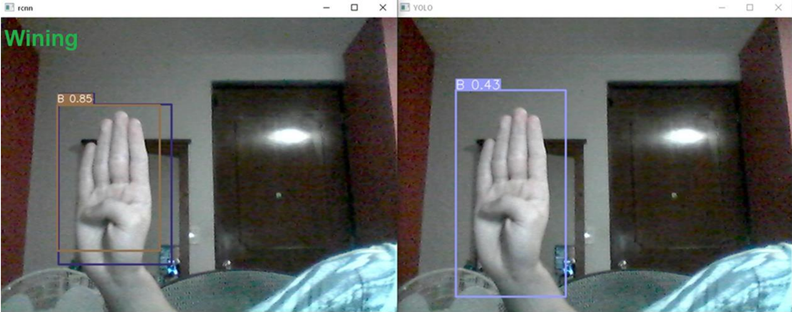

# 🧠 American Sign Language Recognition

This repository contains a computer vision project focused on recognizing American Sign Language (ASL) in real-time video using neural networks.

## 📌 Project Overview

The goal was to compare the performance of two different neural network models for ASL recognition on live video:

- **YOLOv5**
- **Faster R-CNN with MobileNet**

Both models were trained and tested on a non-dedicated GPU system (CPU only), and achieved functional results in real-time scenarios.

## 🧪 Contents

- `YoloTraining.pdf` – Explanation and code for training the YOLOv5 model.
- `RcnnModelTrain_mobilenet.pdf` – Training process and code for the R-CNN model using MobileNet.
- `RealTimeTest.pdf` – Python code and explanation for real-time testing of both models.
- `poster2.pdf` – Summary of the project results, comparison, and visuals.

## 🎥 Live Test Example

## 💬 Notes

- The models were chosen for their balance between speed and accuracy, especially on low-resource hardware.
- The code and documents are meant for educational purposes and as a learning experience in neural networks, OpenCV, and real-time processing.

